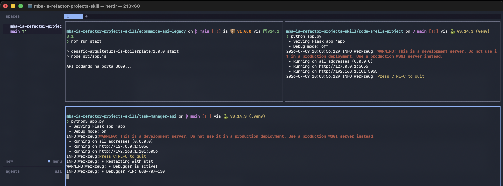

# Desafio — Skill de Refatoração Arquitetural Automatizada

Skill que analisa, audita e refatora qualquer projeto backend para o padrão **MVC**, de forma agnóstica de tecnologia.

A skill executa 3 fases sequenciais: **Análise** → **Auditoria** (com pausa para confirmação) → **Refatoração** (com validação).

A skill vive em `.claude/skills/refactor-arch/` e é copiada para dentro de cada um dos três projetos-alvo:

- `code-smells-project/` — Python/Flask, API de E-commerce (tudo concentrado em poucos arquivos)
- `ecommerce-api-legacy/` — Node.js/Express, API de cursos com checkout (uma classe faz tudo)
- `task-manager-api/` — Python/Flask, API de gerenciador de tarefas (parcialmente organizado)

---

## Análise Manual

### Projeto 1 — `code-smells-project/` (Python/Flask — API de E-commerce)

Todo o código está concentrado em poucos arquivos: `app.py` apenas registra as rotas, `controllers.py` recebe as requisições e `models.py` acumula o acesso ao banco e as regras de negócio de quatro áreas ao mesmo tempo (produtos, usuários, pedidos e relatórios). O banco é um SQLite acessado por uma única conexão compartilhada.

| #   | Severidade   | Problema                                                        | Justificativa                                                                                                                                             |
| --- | ------------ | --------------------------------------------------------------- | --------------------------------------------------------------------------------------------------------------------------------------------------------- |
| 1   | **CRITICAL** | Consultas ao banco montadas "colando" texto do usuário na busca | Qualquer dado enviado (id, e-mail, termo de busca, nome de produto) vai direto para a consulta, abrindo brecha para alguém manipular ou expor o banco.    |
| 2   | **MEDIUM**   | Muitas idas ao banco dentro de laços para listar pedidos        | Para cada pedido é feita uma consulta dos itens e, para cada item, mais uma do produto. Quanto mais dados, mais lento fica — resolvível com uma só busca. |
| 3   | **MEDIUM**   | Mesmo tratamento de erro repetido em todo lugar                 | Cada rota repete o mesmo bloco e ainda devolve a mensagem interna do erro ao usuário, sempre como erro 500. Falta um tratamento central e há repetição.   |
| 4   | **LOW**      | Notificações e logs feitos com `print`                          | E-mails/SMS/push e registros são simulados com `print`, sem um sistema de log adequado — e o envio de notificação está no lugar errado do código.         |
| 5   | **LOW**      | Números "soltos" na regra de desconto do relatório              | As faixas de valor e os percentuais de desconto aparecem direto no código, sem um nome que explique o que significam.                                     |

### Projeto 2 — `ecommerce-api-legacy/` (Node.js/Express — LMS API com checkout)

Praticamente toda a aplicação está em um único arquivo, `AppManager.js`: uma classe que faz tudo — conecta ao banco, cria as tabelas, carrega os dados iniciais e ainda define as três rotas com a lógica escrita ali mesmo. O `utils.js` guarda senhas/segredos e dados compartilhados por todo o sistema.

| #   | Severidade | Problema                                                      | Justificativa                                                                                                                                                                                  |
| --- | ---------- | ------------------------------------------------------------- | ---------------------------------------------------------------------------------------------------------------------------------------------------------------------------------------------- |
| 1   | **HIGH**   | Uma única classe (`AppManager`) faz tudo                      | A mesma classe cuida de conexão com o banco, criação de tabelas, carga inicial, rotas e todo o fluxo de compra/pagamento/matrícula. Sem separação, é impossível testar as partes isoladamente. |
| 2   | **MEDIUM** | Muitas idas ao banco para montar o relatório financeiro       | O código busca os dados curso a curso e depois matrícula a matrícula, com várias consultas separadas. Fica lento conforme o volume cresce; uma consulta combinada resolveria.                  |
| 3   | **MEDIUM** | Ao apagar um usuário, seus dados relacionados ficam para trás | Ao remover o usuário, as matrículas e os pagamentos dele continuam no banco. Isso deixa registros "órfãos" e dados inconsistentes.                                                             |
| 4   | **LOW**    | Nomes de variáveis reduzidos a uma letra                      | Campos e variáveis usam abreviações como `u`, `e`, `p` e nomes encurtados (`usr`, `eml`, `pwd`), o que dificulta entender o que cada coisa representa.                                         |
| 5   | **LOW**    | Dados globais sem uso e `console.log` no lugar de log         | Há dados globais compartilhados que não são realmente usados, e o registro de eventos é feito com `console.log`, sem um sistema de log configurável.                                           |

### Projeto 3 — `task-manager-api/` (Python/Flask — API de Task Manager)

Projeto **parcialmente organizado**: já tem as pastas `models/`, `routes/`, `services/` e `utils/` e usa o SQLAlchemy para acessar o banco. Porém as responsabilidades se misturam — a regra de negócio acaba escrita nas rotas — e ainda há problemas de segurança e trechos repetidos.

| #   | Severidade | Problema                                                  | Justificativa                                                                                                                                                                                                      |
| --- | ---------- | --------------------------------------------------------- | ------------------------------------------------------------------------------------------------------------------------------------------------------------------------------------------------------------------ |
| 1   | **HIGH**   | Senha de e-mail e chave secreta escritas direto no código | A senha do envio de e-mails (SMTP) e a chave secreta estão no próprio código, sem uso de variáveis de ambiente. Ficam versionadas no repositório e visíveis a qualquer um com acesso ao código.                    |
| 2   | **MEDIUM** | Regras de negócio escritas dentro das rotas               | As rotas deveriam apenas coordenar as chamadas, mas aqui fazem cálculos, montam a resposta e agregam relatórios. Existe a pasta `services/`, mas a regra não está lá — e sem subir a aplicação não dá para testar. |
| 3   | **MEDIUM** | Validação repetida e uma função pronta que nunca é usada  | As regras de validação estão reescritas dentro das rotas de criar e editar, enquanto já existe uma função pronta para isso (`process_task_data`) que nunca é chamada. Código repetido e código morto.              |
| 4   | **LOW**    | Captura de erro genérica que esconde o problema           | Vários trechos capturam "qualquer" erro sem identificar qual, devolvendo uma mensagem genérica e escondendo a causa real da falha.                                                                                 |
| 5   | **LOW**    | Bibliotecas importadas sem uso e `print` no lugar de log  | Alguns arquivos importam bibliotecas que não utilizam e registram eventos com `print` em vez de um sistema de log adequado.                                                                                        |

---

## Construção da Skill

### Decisões de design: estrutura do SKILL.md e dos arquivos de referência

Segui o princípio de que **o `SKILL.md` é o prompt** (o _como agir_) e os **arquivos de referência são o conhecimento de domínio** (o _o que saber_). Isso mantém o `SKILL.md` curto e estável, enquanto o conhecimento — que é o que mais evolui a cada iteração — fica isolado em arquivos Markdown carregados sob demanda.

- **`SKILL.md`** — orquestra as 3 fases, define as regras invioláveis (somente-leitura até a confirmação, findings com arquivo:linha, ordenação por severidade, preservação de contrato dos endpoints) e diz **quando** ler cada referência, em vez de embutir o conhecimento.
- **`references/analise-projeto.md`** — heurísticas de detecção de linguagem, framework/versão, banco e mapeamento de arquitetura (Fase 1).
- **`references/catalogo-anti-patterns.md`** — catálogo com sinais de detecção acionáveis e severidade, mais a verificação obrigatória de APIs deprecated (Fase 2).
- **`references/template-relatorio.md`** — formato padronizado do relatório de auditoria (Fase 2).
- **`references/guidelines-mvc.md`** — as 5 camadas MVC, suas responsabilidades e as regras de dependência (Fase 3).
- **`references/playbook-refatoracao.md`** — um padrão de transformação por anti-pattern, com exemplos antes/depois (Fase 3).

### Anti-patterns incluídos no catálogo e por quê

O catálogo tem **14 anti-patterns** (AP-01 a AP-14) com severidade distribuída, mais uma seção dedicada a **APIs deprecated**.

| ID    | Anti-pattern                            | Severidade | Motivo da inclusão                                                       |
| ----- | --------------------------------------- | ---------- | ------------------------------------------------------------------------ |
| AP-01 | Hardcoded credentials / secrets         | CRITICAL   | Segredos versionados expõem credenciais e vazam no histórico do repo     |
| AP-02 | SQL Injection por concatenação          | CRITICAL   | Query montada por string permite injeção e comprometimento do banco      |
| AP-03 | Senha em texto plano / hash fraco       | CRITICAL   | Armazenamento inseguro de senha vaza credenciais em caso de acesso ao DB |
| AP-04 | God Class / God File                    | CRITICAL   | Acúmulo de responsabilidades inviabiliza teste, evolução e reuso         |
| AP-05 | Lógica de negócio no controller/handler | HIGH       | Regra na camada errada quebra o MVC e impede testar sem subir o servidor |
| AP-06 | Estado global mutável                   | HIGH       | Estado compartilhado gera acoplamento oculto e condições de corrida      |
| AP-07 | Acoplamento forte / sem DI              | HIGH       | Dependências instanciadas direto dificultam substituição e mock em teste |
| AP-08 | Query N+1 / query em loop               | MEDIUM     | Consulta dentro de laço escala mal e degrada a performance com volume    |
| AP-09 | Validação de entrada ausente            | MEDIUM     | Entrada não validada gera erros em runtime e dados inconsistentes        |
| AP-10 | Código duplicado                        | MEDIUM     | Lógica repetida multiplica manutenção e o risco de correção parcial      |
| AP-11 | Tratamento de erro ausente/genérico     | MEDIUM     | `catch` genérico engole a causa real e pode vazar detalhe interno        |
| AP-12 | Magic numbers / magic strings           | LOW        | Valores soltos escondem significado e dificultam manutenção              |
| AP-13 | Nomenclatura ruim                       | LOW        | Nomes crípticos reduzem legibilidade e aumentam o custo de leitura       |
| AP-14 | `print`/`console.log` como logging      | LOW        | Log improvisado sem níveis gera ruído e não é configurável em produção   |

### Como garanti que a skill é agnóstica de tecnologia

- **Nada é assumido**: a Fase 1 descobre linguagem, framework e banco pelos manifestos e imports do próprio projeto, com tabelas de detecção que incluem fallback ("se não estiver na tabela, identifique pela extensão predominante + manifesto do ecossistema").
- **As guidelines MVC descrevem responsabilidades e dependências, não sintaxe.** Um procedimento de "como aplicar na stack detectada" (5 perguntas) instrui a skill a usar o mecanismo **nativo** do framework e a seguir a convenção nativa quando o framework já é MVC (Rails, Laravel, Django, Spring...).
- **O playbook define transformações, não código.** Os exemplos usam Python e Node (as stacks do desafio) apenas como ilustração, com nota explícita para traduzir ao idioma da stack detectada.

### Desafios encontrados e como resolvi

- **Comentários "vazando" o processo.** O agente tendia a escrever comentários como `# corrige AP-04` ou copiar os comentários didáticos do playbook. Adicionei uma regra de comentários no `SKILL.md` (só comentar quando agrega valor) e um aviso no topo do playbook.

---

## Resultados

### Resumo dos relatórios de auditoria

Contagem de findings por severidade em cada relatório da Fase 2.

| Projeto              | CRITICAL | HIGH | MEDIUM | LOW | Total | Análise manual    |
| -------------------- | -------- | ---- | ------ | --- | ----- | ----------------- |
| code-smells-project  | 5        | 3    | 4      | 3   | 15    | 1 / 0 / 2 / 2 (5) |
| ecommerce-api-legacy | 4        | 3    | 3      | 3   | 13    | 0 / 1 / 2 / 2 (5) |
| task-manager-api     | 4        | 3    | 4      | 3   | 14    | 0 / 1 / 2 / 2 (5) |

### Comparação antes/depois da estrutura

**Projeto 1 — `code-smells-project/` (Python/Flask)**

```
ANTES                          DEPOIS (MVC)
app.py                         app.py
controllers.py                 .env.example
models.py                      config/settings.py
database.py                    database.py
requirements.txt               models/
README.md                      ├── produto_model.py
                               ├── usuario_model.py
                               └── pedido_model.py
                               controllers/
                               ├── produto_controller.py
                               ├── usuario_controller.py
                               └── pedido_controller.py
                               views/
                               ├── produto_routes.py
                               ├── usuario_routes.py
                               ├── pedido_routes.py
                               └── relatorio_routes.py
                               middlewares/error_handler.py
                               requirements.txt
                               README.md
```

**Projeto 2 — `ecommerce-api-legacy/` (Node.js/Express)**

```
ANTES                          DEPOIS (MVC)
src/                           src/
├── app.js                     ├── app.js
├── AppManager.js              ├── config/config.js
└── utils.js                   ├── database.js
package.json                   ├── models/
README.md                      │   ├── userModel.js
                               │   ├── courseModel.js
                               │   ├── enrollmentModel.js
                               │   └── paymentModel.js
                               ├── controllers/
                               │   ├── checkoutController.js
                               │   └── reportController.js
                               ├── views/
                               │   ├── checkoutRoutes.js
                               │   ├── reportRoutes.js
                               │   └── userRoutes.js
                               └── middlewares/errorHandler.js
                               .env.example
                               package.json
                               README.md
```

**Projeto 3 — `task-manager-api/` (Python/Flask)**

```
ANTES                          DEPOIS (MVC)
app.py                         app.py
database.py                    .env.example
seed.py                        config/settings.py
requirements.txt               database.py
README.md                      seed.py
models/                        models/
routes/                        ├── user.py
services/                      ├── task.py
utils/                         └── category.py
                               controllers/
                               ├── task_controller.py
                               ├── user_controller.py
                               └── report_controller.py
                               routes/ (views)
                               services/notification_service.py
                               middlewares/error_handler.py
                               utils/helpers.py
                               requirements.txt
                               README.md
```

### Checklist de validação

Foi aplicado nos 3 projetos: `code-smells-project/`, `ecommerce-api-legacy/` e `task-manager-api/`

```markdown
## Checklist de Validação

### Fase 1 — Análise

- [x] Linguagem detectada corretamente
- [x] Framework detectado corretamente
- [x] Domínio da aplicação descrito corretamente
- [x] Número de arquivos analisados condiz com a realidade

### Fase 2 — Auditoria

- [x] Relatório segue o template definido nos arquivos de referência
- [x] Cada finding tem arquivo e linhas exatos
- [x] Findings ordenados por severidade (CRITICAL → LOW)
- [x] Mínimo de 5 findings identificados
- [x] Detecção de APIs deprecated incluída (se aplicável)
- [x] Skill pausa e pede confirmação antes da Fase 3

### Fase 3 — Refatoração

- [x] Estrutura de diretórios segue padrão MVC
- [x] Configuração extraída para módulo de config (sem hardcoded)
- [x] Models criados para abstrair dados
- [x] Views/Routes separadas para visualização ou roteamento
- [x] Controllers concentram o fluxo da aplicação
- [x] Error handling centralizado
- [x] Entry point claro
- [x] Aplicação inicia sem erros
- [x] Endpoints originais respondem corretamente
```

### Logs / screenshots das aplicações rodando



---

## Como Executar

### Pré-requisitos

- **[Claude Code](https://docs.anthropic.com/en/docs/claude-code/overview)** instalado e autenticado (ferramenta escolhida para o desafio).
- **Python 3.10+** e `pip` — para `code-smells-project` e `task-manager-api`.
- **Node.js 18+** e `npm` — para `ecommerce-api-legacy`.
- **`curl`** (ou o `requests.http` criado) para validar os endpoints.

### Comandos para executar a skill em cada projeto

```bash
# Projeto 1 — code-smells-project (Python/Flask)
cd code-smells-project
claude "/refactor-arch"

# Projeto 2 — ecommerce-api-legacy (Node.js/Express)
cd ../ecommerce-api-legacy
claude "/refactor-arch"

# Projeto 3 — task-manager-api (Python/Flask)
cd ../task-manager-api
claude "/refactor-arch"
```

Em cada execução: a **Fase 1** imprime o resumo da stack; a **Fase 2** gera o relatório, salva em `reports/audit-<projeto>.md` e **pausa** pedindo confirmação (`[y/n]`) — responda `y` para seguir; a **Fase 3** refatora, valida e atualiza o `README.md` do projeto.

### Como validar que a refatoração funcionou

Em cada projeto, suba a aplicação com os comandos abaixo e valide os endpoints com o arquivo `requests.http` da raiz do projeto (extensão REST Client no VS Code) ou com `curl`.

**Projeto 1 — `code-smells-project` (Python/Flask)**

```bash
cd code-smells-project
python3 -m venv venv
source venv/bin/activate
pip install -r requirements.txt
cp .env.example .env
python app.py
```

**Projeto 2 — `ecommerce-api-legacy` (Node.js/Express)**

```bash
cd ecommerce-api-legacy
npm install
npm start
```

**Projeto 3 — `task-manager-api` (Python/Flask)**

```bash
cd task-manager-api
python3 -m venv .venv
source .venv/bin/activate
pip install -r requirements.txt
cp .env.example .env
python3 seed.py
python3 app.py
```

Considerei a refatoração bem-sucedida quando, em cada projeto, a aplicação **inicia sem erros** e os endpoints continuam respondendo com o mesmo contrato.
